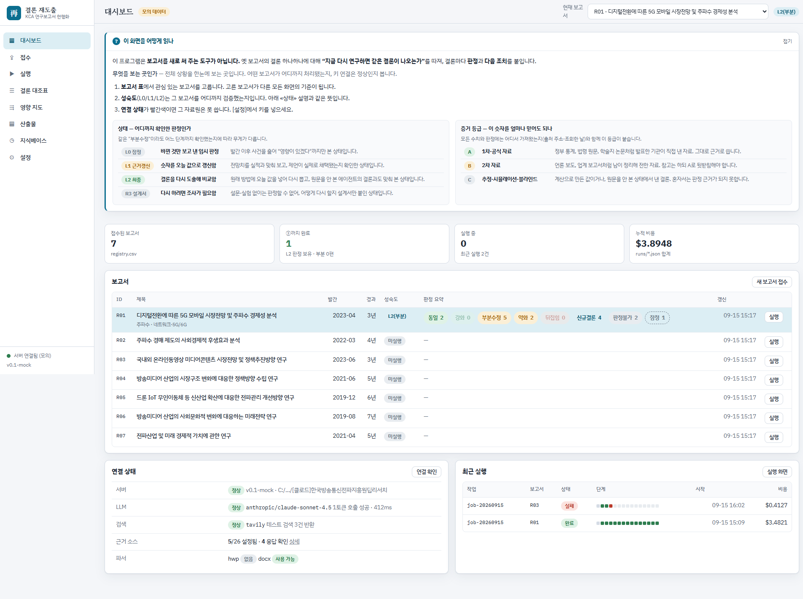
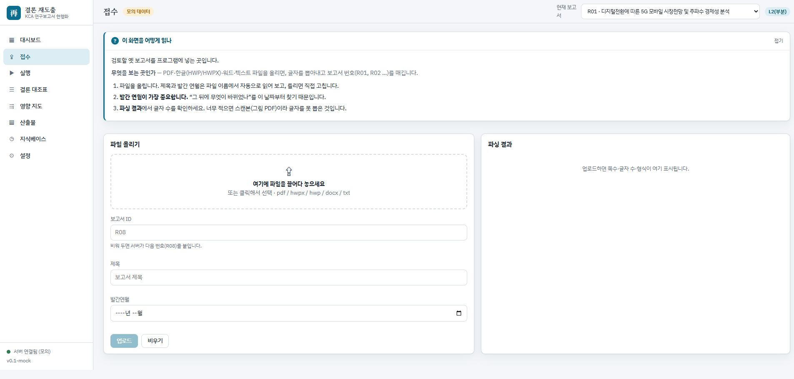
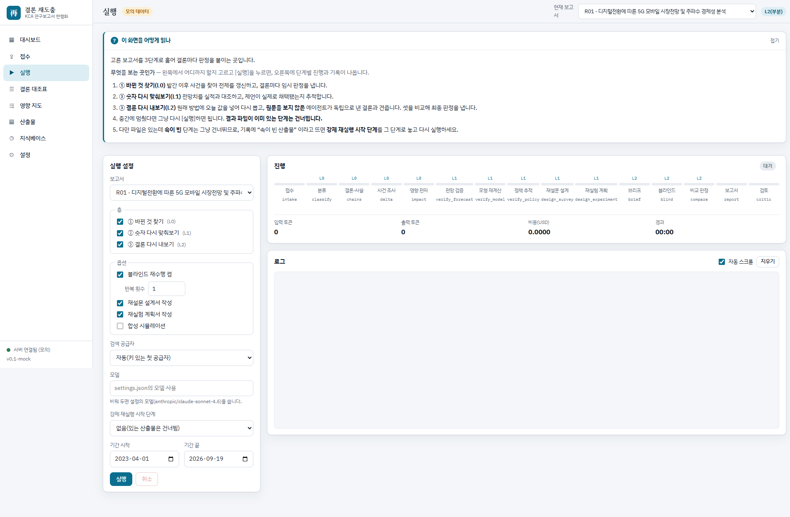
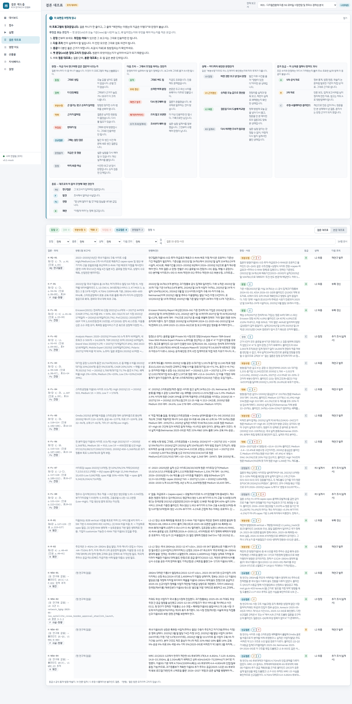
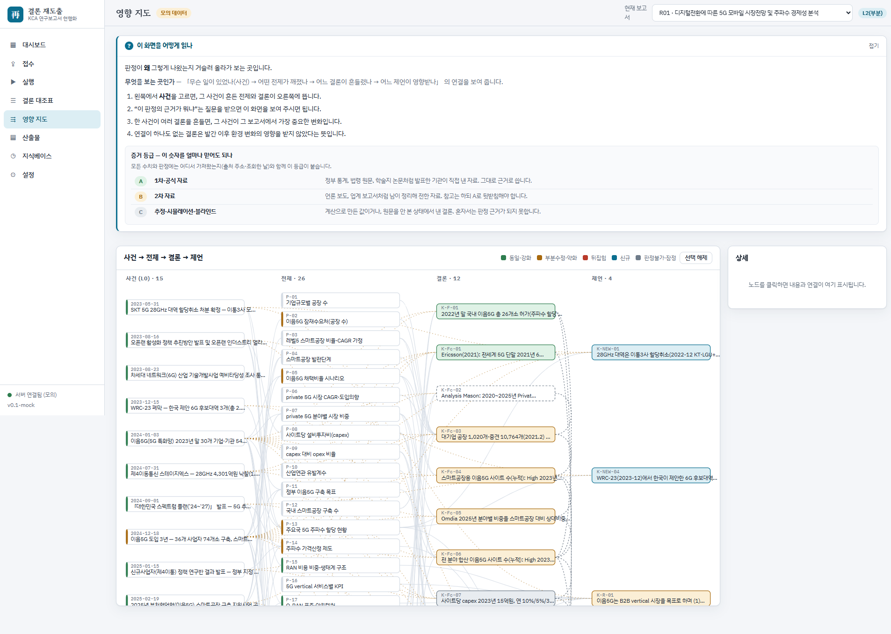
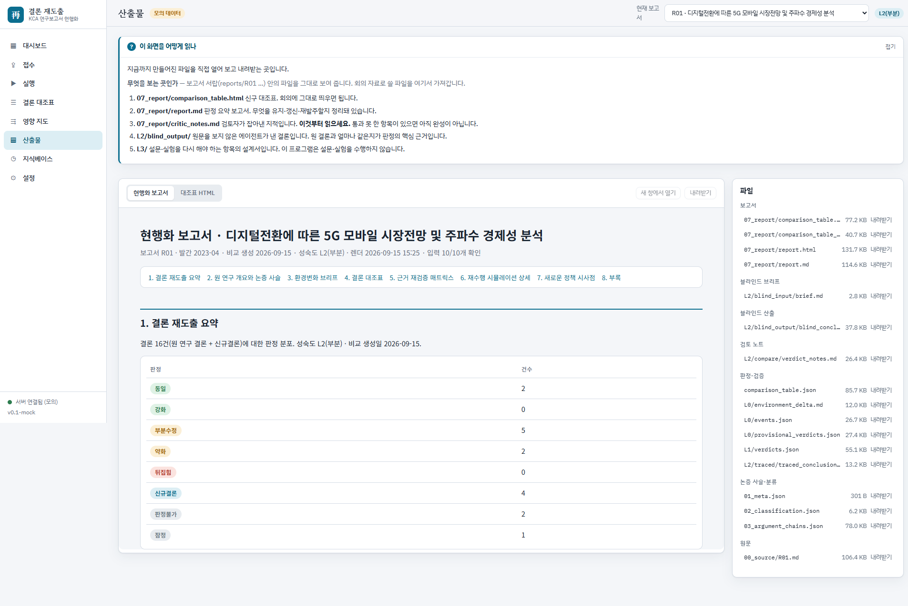
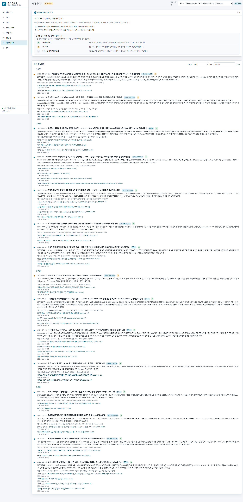
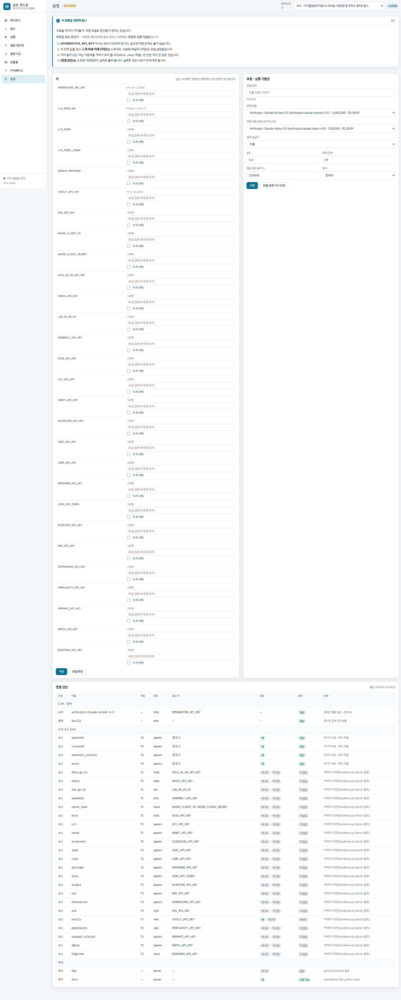

# KCA 연구보고서 결론 재도출·현행화 하네스

[](https://github.com/cdsassj00/kca-refresh-harness/actions/workflows/ci.yml)

옛 연구보고서를 넣으면, 규칙과 절차 안에서 움직이는 AI 조사팀이 **발간 이후 바뀐 것**을 찾고 **결론 하나하나에 도장**(그대로 / 고칠 것 / 뒤집힘 / 재조사 필요)을 찍어 **신구 대조표**와 **다음 조치**로 내주는 도구입니다.

새 보고서를 대신 써 주는 도구가 **아닙니다**. 어느 결론이 아직 살아 있고, 어느 연구를 다시 해야 하는지 근거를 갖고 가려내는 도구입니다.

## 두 가지 실행 방식

같은 규칙·절차서·지식베이스·계산기를 두 가지 방법으로 돌릴 수 있습니다. **독립 프로그램을 기본으로 권장**합니다.

| | **독립 프로그램** (권장) | **Claude Code 하네스** |
|---|---|---|
| 필요한 것 | Python 3.11 + **OpenRouter API 키** 하나(종량제, 선불 크레딧) | Python 3.11 + Node.js + **Claude Code 로그인**(Claude 구독 또는 기관 발급 Anthropic 키) |
| 모델 | OpenRouter 의 어떤 모델이든(OpenAI·Anthropic·Google·오픈소스). OpenAI 호환 API 면 직접 연결도 가능 | Claude |
| 대상 | 실무자 누구나. 브라우저 화면에서 접수·실행·열람 | Claude Code 를 이미 쓰는 사람. 터미널에서 스킬·서브에이전트로 실행 |
| 입력 형식 | PDF · HWPX · DOCX · TXT (HWP 는 선택 설치) | PDF |
| 시작 명령 | `app\run_app.bat` → 브라우저 `http://127.0.0.1:8765` | `setup.bat` → Claude Code 에서 `/refresh-run R01` |
| 문서 | [app/SETUP.md](app/SETUP.md) (설정 체크리스트) · [app/README.md](app/README.md) (개요·화면·구조) | [SETUP.md](SETUP.md) (설정 체크리스트) · [AGENTS.md](AGENTS.md) (다른 도구·수동 모드) |

두 방식은 **같은 `reports/<ID>/` 서랍과 `registry.csv` 를 공유**합니다. 어느 쪽으로 돌려도 같은 파일이 남고, 서로 열어 볼 수 있습니다. 어떤 파일이 어느 묶음(공통 핵심 / 하네스 / 독립 프로그램)인지: [docs/폴더_구성.md](docs/폴더_구성.md)

- 쉬운 설명: [docs/하네스_구조_쉬운설명.md](docs/하네스_구조_쉬운설명.md) · 그림 설명 페이지: [docs/explainer/kca-rederivation-explainer.html](docs/explainer/kca-rederivation-explainer.html)
- 구성과 기술 스펙: [docs/설명서_구성과_기술스펙.md](docs/설명서_구성과_기술스펙.md)
- API 키 발급: [docs/api_keys_guide.md](docs/api_keys_guide.md) (0절 OpenRouter)
- 설계서: [docs/superpowers/specs/2026-09-15-kca-refresh-harness-design.md](docs/superpowers/specs/2026-09-15-kca-refresh-harness-design.md) · 독립 프로그램 설계·계약: [app/DESIGN.md](app/DESIGN.md)

## 무엇이 나오나 (샘플 R01, 5G 시장전망 보고서 2023)

한 줄 요약: **결론 12개 중 동일 2 · 부분수정 5 · 약화 2 · 판정불가 2 · 잠정 1, 그리고 원 연구에 없던 신규 결론 4.**

| 결론 | 원 보고서 (2023) | 지금 (2026-09) | 판정 · 다음 조치 |
|---|---|---|---|
| 국내 이음5G 현황 | 2022년 말 26곳 | 공식 집계 일치, 2025년 말 104곳 | 동일 · 부록 갱신 |
| 국내 이음5G 구축 수 전망 | 2025년 중간 시나리오 93곳, 2030년 910곳 | 실적 104곳(오차 약 10%), 원 방법으로 2030년을 다시 계산하면 실적보다 작아지는 모순 | 약화 · 재연구 발주 |
| 전세계 5G 가입 | 2027년 44억 | 최신 전망 41억 (7% 차이) | 동일 · 부록 갱신 |
| 사이트당 설비투자비·파급효과 | 15억원 가정 | 공개된 실제 구축비 없음 | 판정불가 · 추가 조사 설계서 |
| 고대역(28GHz) 주파수 제언 | 주요국처럼 24~28GHz 확대 | 이통3사 반납·제4이통 무산 | 부분수정 · 재연구 발주 |
| O-RAN 이음5G 시장 | B2B 우선 | 오픈랜 정책·실증 진행 중 | 부분수정 · 부록 갱신 |
| (원 연구에 없음) | – | 28GHz 미할당 대역의 용도 전환, 저궤도 위성 진입, 6G 후보대역 확정 등 | 신규 결론 4건 |

실제 산출물은 `reports/R01/`에 들어 있습니다. 대조표: `reports/R01/07_report/comparison_table.html`, 판정 근거: `reports/R01/L2/compare/verdict_notes.md`

## 화면 (독립 프로그램)

아래 사진은 모두 **샘플 보고서 R01** 로 찍은 것입니다. 직접 보시려면 `run_app.bat` 을 실행하고
주소 뒤에 `?mock=1` 을 붙이면 키 없이도 같은 화면을 볼 수 있습니다 — `http://127.0.0.1:8765/?mock=1`

화면마다 맨 위에 **「이 화면을 어떻게 읽나」** 칸이 있습니다. 등급·판정·상태가 무슨 뜻인지
그 자리에서 풀어 놓았으니, 처음 쓰시는 분은 그 칸부터 펼쳐 보시면 됩니다.

### 1. 대시보드 — 어느 보고서가 어디까지 왔나
어떤 보고서를 검토 중인지, 각 보고서를 어느 단계까지 확인했는지(L0→L1→L2), 자료원 연결은 정상인지 한눈에 봅니다.



### 2. 접수 — 옛 보고서를 넣는다
PDF·한글(HWP/HWPX)·워드·텍스트를 올리면 글자를 뽑아 보고서 번호를 매깁니다.
**발간 연월이 가장 중요합니다.** "그 뒤에 무엇이 바뀌었나"를 이 날짜부터 찾기 때문입니다.



### 3. 실행 — 3단계로 훑는다
왼쪽에서 어디까지 할지 고르고 실행하면, 오른쪽에 15단계 진행과 기록이 실시간으로 쌓입니다.
중간에 멈춰도 **결과가 있는 단계는 건너뛰고 이어서** 갑니다. 기록은 파일로 남아 화면을 새로 고쳐도 다시 올라옵니다.



### 4. 결론 대조표 — **이 프로그램의 결과물**
결론 하나가 한 줄입니다. 옛 문장(old)과 오늘 기준(new)을 나란히 놓고 **판정**과 **다음 조치**를 붙입니다.
옛 문장은 절대 고치지 않습니다. 원문이 무엇이었는지 남아야 비교가 되기 때문입니다.

- **판정** 동일 · 강화 · 부분수정 · 약화 · 뒤집힘 · 신규결론 · 판정불가
- **다음 조치** 유지 · 부록 갱신 · 재연구 발주 · 폐기(아카이브) · 추가 조사(설계서)
- **등급** A 1차·공식 / B 2차 / C 추정·시뮬레이션



### 5. 영향 지도 — 판정이 **왜** 그렇게 나왔나
「무슨 일이 있었나(사건) → 어떤 전제가 깨졌나 → 어느 결론이 흔들렸나 → 어느 제언이 영향받나」의 연결을 따라갑니다.
"이 판정의 근거가 뭐냐"는 질문에 이 화면으로 답합니다.



### 6. 산출물 — 회의에 가져갈 파일
신구 대조표(HTML), 판정 요약 보고서, **검토자 지적 사항**, 블라인드 재수행 결과, 재설문·재실험 설계서를 여기서 열고 내려받습니다.



### 7. 지식베이스 — 여러 보고서가 함께 쓰는 사건 창고
"2024년 몇 월에 무슨 법이 바뀌었다" 같은 사건을 한 번 조사해 적어 두고 다시 씁니다.
같은 분야 보고서를 여러 편 돌릴수록 뒤에 하는 검토가 빨라집니다.



### 8. 설정 — 키와 모델
자료원 키는 `.env` 에만 저장되고 화면에는 가려서 보여 줍니다. **[연결 확인]** 을 누르면 자료원마다 실제로 불러 보고,
실패한 곳은 사유를 한국어로 알려 줍니다.



## 3단계 동작

1. **바뀐 것 찾기** 발간 이후 사건을 찾아 전제를 갱신하고 결론별 잠정 판정. 어떤 보고서든 바로 됩니다.
2. **숫자 다시 맞춰보기** 전망은 실적과 비교, 모형은 재계산, 제언은 채택 여부 추적.
3. **결론 다시 내보기** 원 방법에 오늘 값을 넣어 다시 도출하고, 원문을 보지 않은 AI가 독립적으로 결론을 내서 셋을 비교해 판정.

## 빠른 시작

### A. 독립 프로그램 (권장, Claude Code 불필요)

```bat
app\run_app.bat
```
브라우저가 열리면 **[설정]** 에서 OpenRouter 키 입력 → **연결 확인** → 모델 선택. 그다음 **[대시보드]** 의 R01 을 열어 대조표를 봅니다. 자기 보고서는 **[접수]** 에 파일(PDF·HWPX·DOCX)을 끌어다 놓고 **[실행]** 에서 층(L0/L1/L2)을 골라 실행합니다. 자세한 순서와 비용·데이터 경로 안내는 [app/SETUP.md](app/SETUP.md).

### B. Claude Code 하네스

```bat
setup.bat
```
그 다음 Claude Code에서 이 폴더를 열고:
```
/refresh-run R01
```
자기 보고서를 돌리려면 PDF를 준비하고:
```bat
python scripts\intake.py R08 "C:\경로\내보고서.pdf"
```
Claude Code에서 `/refresh-run R08`. 자세한 설정은 [SETUP.md](SETUP.md). Codex·Cursor 등 다른 도구나 웹 채팅만 있을 때는 [AGENTS.md](AGENTS.md).

## 폴더

| 폴더·파일 | 묶음 | 역할 |
|---|---|---|
| `prompts/` | 공통 핵심 | 단계별 역할 지시서 원본 (00 접수 … 08 검토, 05a 브리프). 도구 중립 마크다운. 두 방식이 모두 이 파일을 그대로 읽습니다 |
| `templates/` | 공통 핵심 | 유형 분류체계, 판정 규칙, 스키마 8종, 설계서 양식 |
| `kb/` | 공통 핵심 | 지식베이스: 사건, 근거, 도메인 프로파일, 출처 등급 |
| `scripts/` | 공통 핵심 | 계산기·검사기: 접수, 근거 수집(evidence), 스키마 검증, 레지스트리, 대조표·보고서 렌더 |
| `samples/pdf/` | 공통 핵심 | 공개 샘플 보고서 7편 (KCA 홈페이지 공개본) |
| `reports/<ID>/` | 공통 핵심 | 보고서 서랍 하나. 원문·결론 사슬·단계별 산출·대조표·보고서 |
| `registry.csv` | 공통 핵심 | 현황판: 보고서별 발간 연도, 경과 연수, 진행 단계 |
| `tests/` | 공통 핵심 | 계산기·스키마 자동 테스트 (`python -m pytest`) |
| `app/` | 독립 프로그램 | 브라우저 화면판. `run_app.bat`, `engine/`, `server/`, `ui/`, `app/.env`(키) |
| `CLAUDE.md` | Claude Code 하네스 | 규칙집. Claude Code가 이 폴더를 열면 자동으로 읽습니다 (독립 프로그램은 "규칙" 절을 시스템 프롬프트로 씁니다) |
| `.claude/skills/`, `.claude/agents/` | Claude Code 하네스 | Claude Code용 절차서와 역할 카드 (prompts를 감쌈) |
| `AGENTS.md` | Claude Code 하네스 | Claude Code가 아닌 도구(Codex·Antigravity·Cursor 등)와 수동 모드 안내 |
| `setup.bat`, `.env` | Claude Code 하네스 | 설치 스크립트, 근거 소스 API 키 (내 PC에만, git 제외) |
| `docs/` | 문서 | 설명서, 설계서, API 키 발급 가이드, 폴더 구성 |

## 근거 소스

키 없이 되는 것(OpenAlex, Crossref, arXiv, Semantic Scholar, 웹 검색)만으로 1단계가 돌아갑니다. 국내 통계·법령·뉴스 키를 넣으면 2단계 검증이 정확해집니다. 발급 방법: [docs/api_keys_guide.md](docs/api_keys_guide.md). 상태 확인:
```bat
python scripts\evidence.py doctor
```
독립 프로그램은 같은 내용을 **[설정]** 화면의 doctor 표로 보여 줍니다. 키는 하네스는 루트 `.env`, 독립 프로그램은 `app/.env` 에 둡니다.

## 하지 않는 것

- 설문·실험을 대신하지 않습니다. 필요한 결론은 "판정 불가"로 두고 재조사 설계서를 붙입니다.
- 출처 없는 숫자를 내지 않습니다. 모든 수치에 출처·조회일·증거 등급(A 공식 / B 2차 / C 추정)이 붙습니다.
- 원 결론 문장을 고치지 않습니다. 대조표의 "현행" 열은 원문 그대로입니다.

## 현재 범위와 다음 단계

- 지금: 3단계 파이프라인(두 실행 방식), 대조표 HTML, 현행화 보고서 Markdown/HTML, 근거 소스 T0(무료 키 없음). 독립 프로그램은 PDF·HWPX·DOCX·TXT 접수와 브라우저 화면(접수·실행·열람·키 설정)까지
- 다음: 국내 통계·법령·뉴스 커넥터(키 있을 때), 한글(HWPX) 출력, 재설문·재실험 설계서 자동 생성(L3)

## 데이터 취급

내부 문서를 AI 서비스에 보내도 되는지는 **기관이 판단**합니다. 이 저장소에는 코드·규칙·공개 샘플만 있고, 여러분의 보고서 원문과 산출물은 여러분 PC의 `reports/`에만 남습니다(`.gitignore` 참고). 키는 `.env`(하네스) 또는 `app/.env`(독립 프로그램)에만 있습니다.

- Claude Code 하네스: 원문 글자와 검색어가 Anthropic 으로 갑니다.
- 독립 프로그램: 원문 글자와 검색어가 **OpenRouter → 선택한 모델 제공사**로 갑니다. OpenRouter 계정 설정(Privacy)에서 학습·로그 허용 여부를 정할 수 있고, 특정 제공사와 직접 계약한 API 로 바꾸려면 `LLM_BASE_URL` 을 바꿉니다. 자세한 표는 [app/SETUP.md](app/SETUP.md) "데이터가 어디로 가나".
